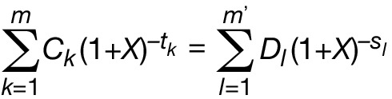
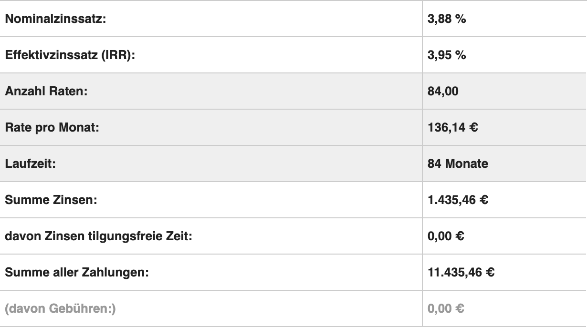
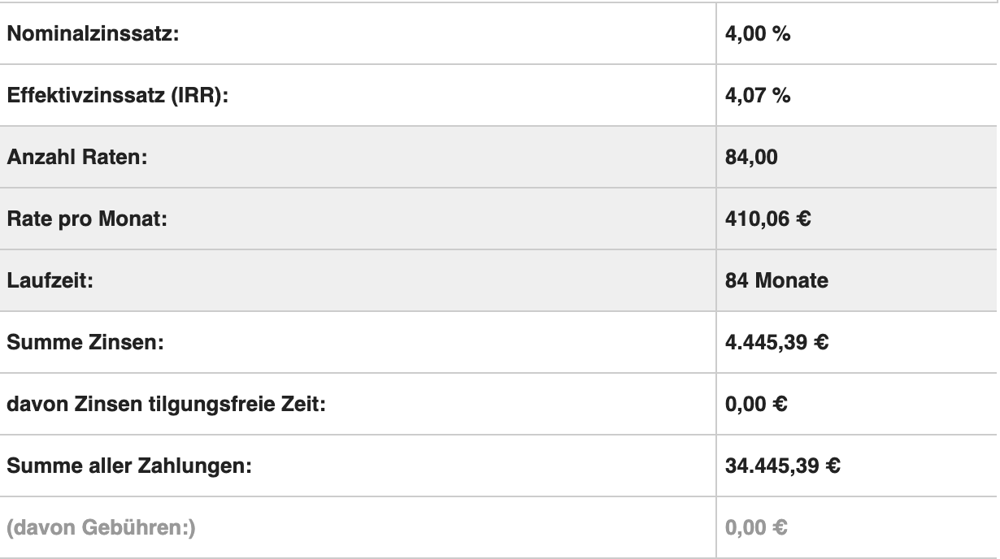

Professor:: Dr. Bernd Kahlbrandt  
Author:: Hani Alshikh  
<div style="text-align: right">21.03.2020</div>

# A01: Java Grundlagen

## 1. Java Denksportaufgaben

### 1.1. Char vs String

```java
10 System.out.print("H" + "a"); // => Ha
20 System.out.println(’H’ + ’a’); // => "169\n"
// die Summe der dezimalen Werte (72 + 97)
```

### 1.2. Null Pointer

```java
10 public class Unbelievable {
20  static Integer i;
30  public static void main(String[] args) {
40      if (i == 42)
50          System.out.println("Unbelievable");
60      }
70 }
```

Zeile ```20``` erstellt eine Variable ```i```, die einen Pointer enthält, der auf nichts verweist, was zu einem ```NullPointerException``` führt. Man könnte z.b. die Variable den Wert 42 geben, damit der Code einwandfrei durchgeführt werden kann.
```java
20 static Integer i = 42;
```

## 2. Numerik in Java

für die Berechnung wird die Formel der PAngV benutzt:<br>
<br>

Allerdings weichen die Ergebnisse vom Aufgabenblatt ab. Die Ergebnisse wurden von mehreren Online Rechner bestätigt und sollten richtig sein. beim Autokredit war es schwere zu überprüfen, da keinen online Rechner die Möglichkeit anbietet, erste- und Schlussrate anzugeben.

<p float="left">
    
    
</p> 

Quelle: [Finanz Rechner](https://www.finanzen-rechner.net/kreditrechner.php)

auf der linken Seite der Gleichung ist der mit dem Effektivzinssatz zu rechnen Betrag und auf der rechten Seite ist der Betrag des Kredits. In Code übersetzt (Dank Jannik Stuckstätte & Johan Kemper) sieht so aus:
```java
private static double calculateDifference(double amount, double annualInterestRate, double[] monthlyPayments) {
    double sum = 0;
    for (int i = 1; i <= monthlyPayments.length; i++) {
            sum += monthlyPayments[i - 1] * Math.pow((1 + annualInterestRate), -(1.0 / 12.0 * i));
        }
    return amount - sum;
}
```  

um Den Effektivzinssatz zu berechnen ( ```double annualInterestRate``` Variable X in (1+x)) also die Nullstellen der Gleichung zu finden wird das Intervallhalbierungsverfahren benutzt. Nehmen wir das erste Beispiel aus der Aufgabe hat man a = 0.0388 und b = 0.0488 als Interval. b muss nicht 0.0488 sein man sollte zwei gute Werte finden, die den Sprung von negativ auf positiv machen (intervallhalbierungsverfahren) das kann man berechnen lassen (f(a) und f(b)). Wir addieren zu a des Intervalls und subtrahieren von b delta (in diesem Fall 0.0001) solange, bis den Sprung gefunden wird.

```java
private static double[] calcInterval(double amount, double interestRate, double[] monthlyPayments) {
    double[] interval = {interestRate, interestRate + intervalSize};
    while (calculateDifference(amount, interval[0], monthlyPayments) < 0){
            interval[0] += delta;
        }
    while (calculateDifference(amount, interval[1], monthlyPayments) > 0){
            interval[1] -= delta;
        }
    return interval;
}
```

von den neuen Intervall Werte wird den Durchschnitt gerechnet. und in der Formel eingesetzt. Wenn die Summe negativ ist  wird den a Wert unseres Intervalls ersetzt, wenn positiv den b wert. Das wird solange gemacht, bis die Differenz großer 10^-6 nach Aufgabe Anforderung.

```java
private static double calculateAnnualInterestRate(double amount, double interestRate, double[] monthlyPayments) {
    double annualInterestRate = 0.0;
    // calculate starting intervals for Bisection method
    double[] interval =  calcInterval(amount, interestRate, monthlyPayments);
    // the difference between the actual amount and the calculated one
    double difference = 1;
    // if the difference is smaller than the precision value the approximation is achieved
    while (difference > precision) {
        // Calculate c, the midpoint of the intervalls
        annualInterestRate = (interval[0] + interval[1]) / 2;
        difference = calculateDifference(amount, annualInterestRate, monthlyPayments);
        if (difference > 0) {
            interval[0] = annualInterestRate;
        } else {
            interval[1] = annualInterestRate;
        }
    }
    return annualInterestRate;
}
``` 

### Inkrementieren Methode

man könnte auch, den Fakt ausnutzen, dass der Effektivzinssatz immer größer als der nominal Satz ist, und somit den Wert des nominalen Satzes solange inkrementieren, bis man auf einen Wert kommt, der die Differenz so nah wie möglich zu 0 annähert.

##### Quellen
- [What is a NullPointerException, and how do I fix it?](https://stackoverflow.com/questions/218384/what-is-a-nullpointerexception-and-how-do-i-fix-it)
- [Kredit Rechner](https://www.finanzen-rechner.net/kreditrechner.php)
- [PAngV](http://www.gesetze-im-internet.de/pangv/anlage.html)
- [Bisection method](https://en.wikipedia.org/wiki/Bisection_method)
- [Effektiver Jahreszins](https://de.wikipedia.org/wiki/Effektiver_Jahreszins)