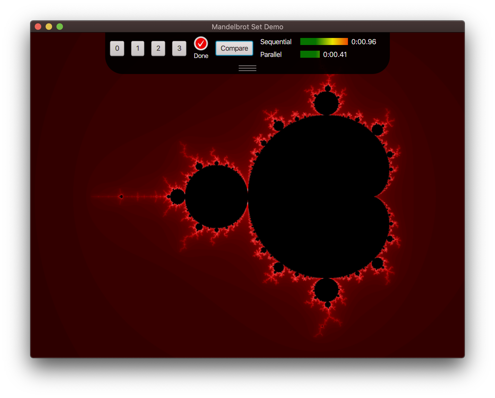
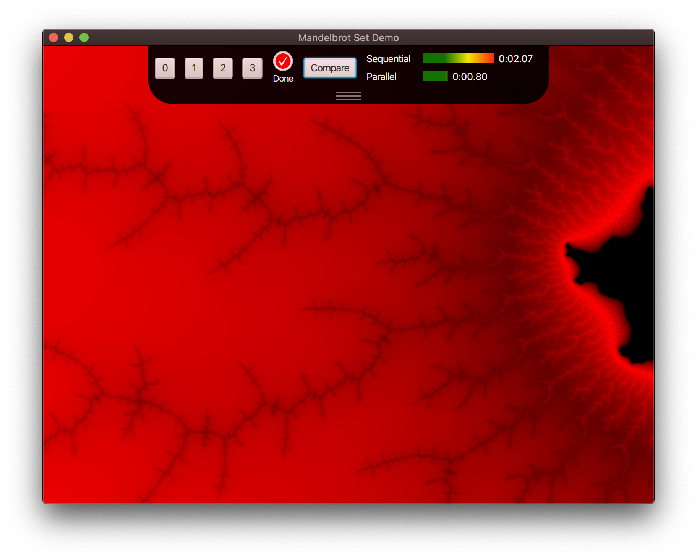
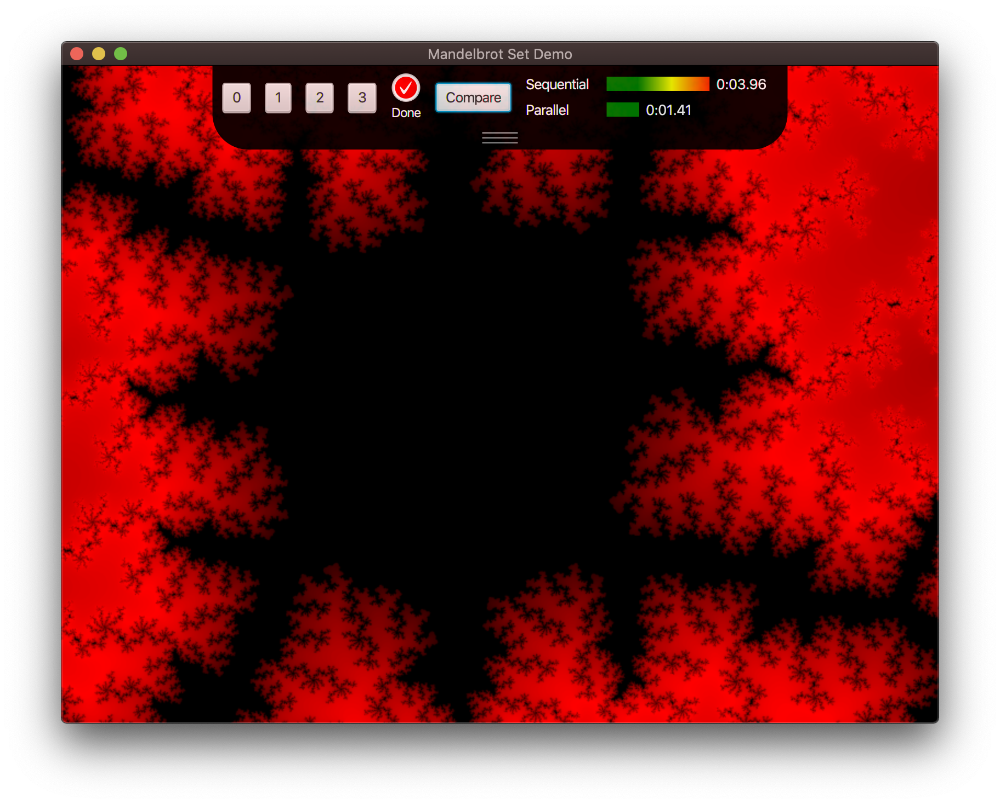
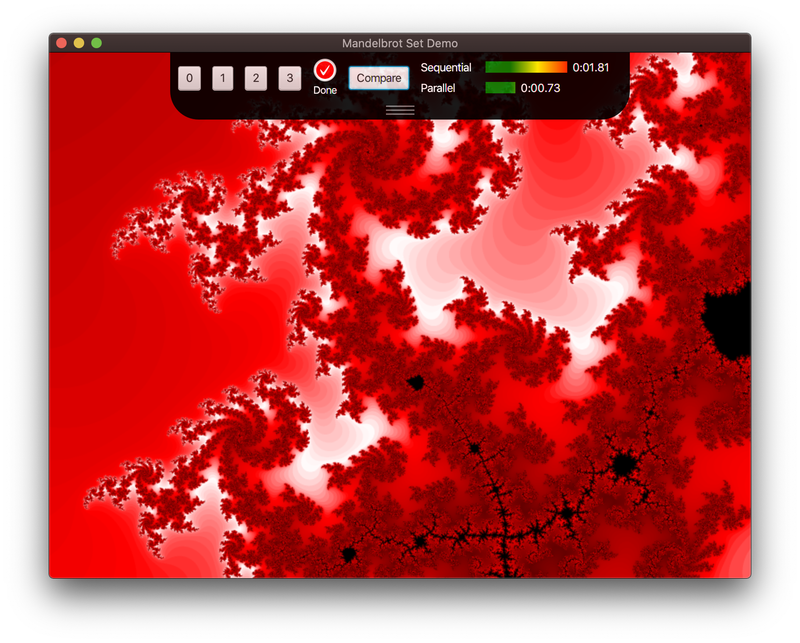

Professor: Dr. Bernd Kahlbrandt  
Author: Hani Alshikh

07.06.2020

# A07.3: Fraktale

- Notieren Sie bitte vom Eindruck des Bildschirmaufbaus und der Zeitangaben Laufzeiten auf Ihrem Rechner, woei die Leistungsdaten Ihres Rechners:

