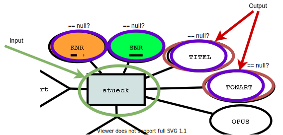
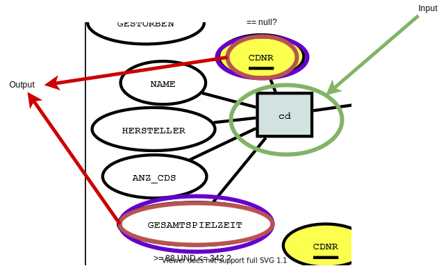
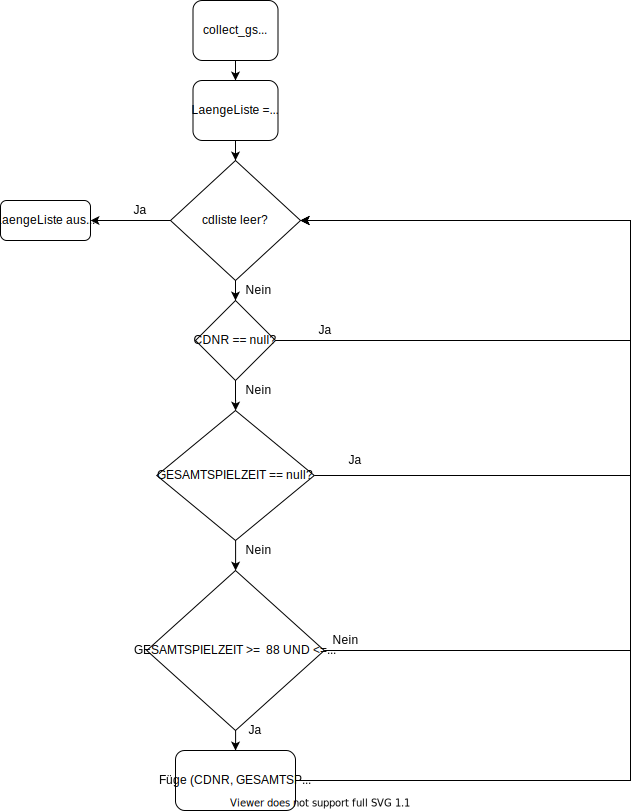
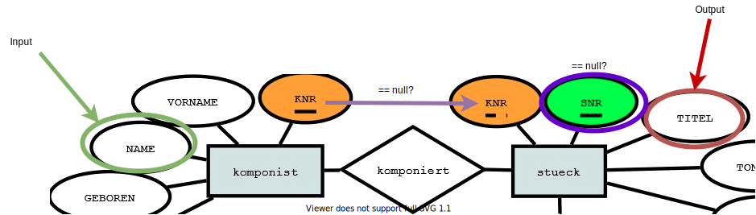
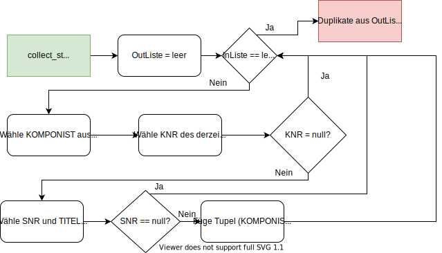
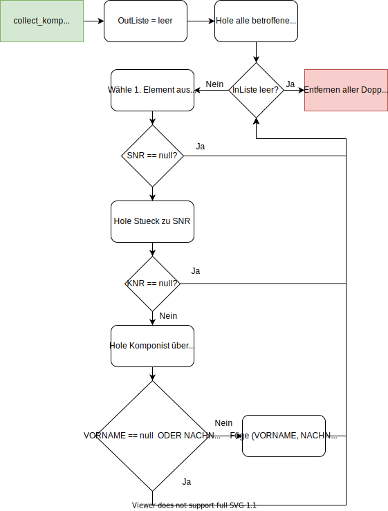
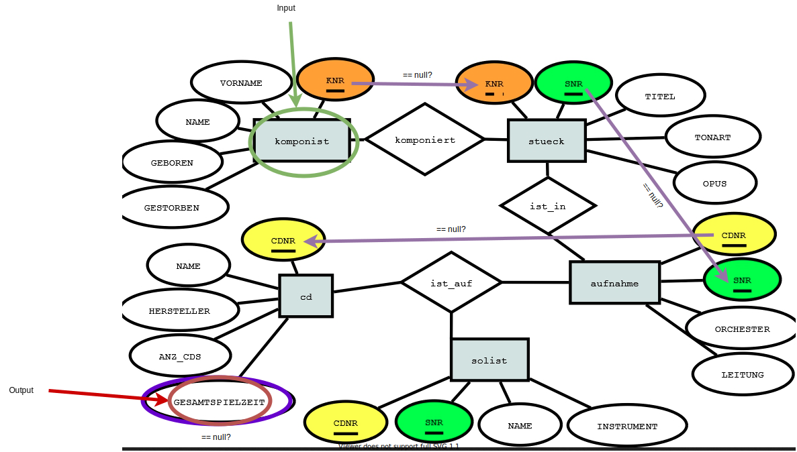
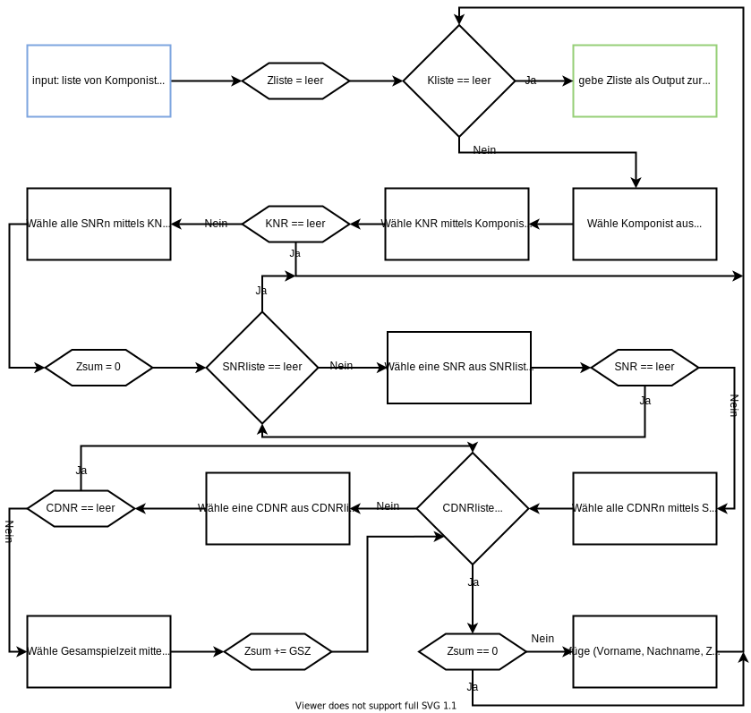

# Aufgabe 1 - Version 1

11.04.2020

**Team:** 30, Hani Alshikh, Jannik Stuckstätte

**Aufgabenaufteilung:**

- Jannik Stuckstätte
  - Alle Datenbankentwürfe für den ersten Teil der Aufgabe
  - Programabläufe 2, 3 und 4 des ersten Teils
  - Entwürfe der 5.ten und 6.ten Teilaufgabe des zweiten Teils
  - Prolog implementierung des ersten Teils der Aufgabe
  - alles überprüfen vor der Abgabe
- Hani Alshikh
  - Programabläufe 1 und 5 des ersten Teils der Aufgabe
  - Entwürfe der ersten und zweiten Teilaufgabe des zweiten Teils
  - Pflege der PDF-Datei
  - Prolog implementierung des zweiten Teils der Aufgabe
  - Code Dokumentation
  - Darstellung der fehlenden Algorithmen des zweiten Teil

Jeder von uns hat zunächst alle Programabläufe/Teile der Aufgabe für sich entworfen/impliementiert. Im Anschluss haben wir uns dann in Absprache für eines entschieden oder sie zu einem Ergebnis zusammengeführt.

**Quellenangaben:**

- Verschiedene Wikipedia-Artikel für die Definitionen der Verwandschaftsverhältnisse
- [Syntax in Prolog](http://rigaux.org/language-study/syntax-across-languages-per-language/Prolog.html)
- die Folien "LB_Prolog"

**Bearbeitungszeitraum:**  

- 02.04. Jannik Stuckstätte 4 Std.  
- 04.04. Hani Alshikh 6 Std.
- 05.04. Jannik Stuckstätte 3 Std.  
- 05.04. Hani Alshikh 3 Std.  
- 08.04. Hani Alshikh 5 Std.
- 09.04. Jannik Stuckstätte 3 Std.
- 10.04. Jannik Stuckstätte 1 Std.
- 10.04. Hani Alshikh 3 Std.

**Aktueller Stand:**

- Die Entwürfe aller Aufgaben sind fertig
- Der erster Teil ist in Prolog implementiert
- Der zweiter Teil ist in Prolog implementiert

**Änderungen des Entwurfs:** -

- collect_stuck: keine InputListe wurde gebraucht, die Duplikate mussten doch gelöscht werden.
- collect_gs: keine InputListe wurde gebraucht, die Duplikate mussten doch gelöscht werden.
- collect_st: nichts wurde geändert.
- collect_komp: nichts wurde geändert.
- collect_time: Das Erstellen der Liste mit allen CDs jedes Komponisten und das anschließende Aufsummieren der Gesamtspielzeiten wurde entgegen dem Entwurf in zwei separaten Schritten durchgeführt.
- bei der gesamten Aufgabe 6 des zweiten Teils wurde als einziger Parameter eine Ausgabeliste benötigt.

**Entwurf:**

1. Wie viele Stunden je Woche üben Sie ca. LB?  
    ~10 Std. (inklusive Bearbeitung des Praktikums)

2. Mit welchen digitalen Medien tauschen Sie sich im Team aus?  
   - Whatsapp, Discord und Gitlab

3. Welche Quellen haben Sie bisher für Aufgaben/Übungen/Erklärungen genutzt?  
   - Vorlesungsaufzeichnungen
   - [Prolog Tutorial](https://www.youtube.com/watch?v=SykxWpFwMGs&)
   - [bSimple](https://www.youtube.com/channel/UCCTii-_z90kaxio8AdGF3Bw)

4. Wie messen Sie Ihren Lernfortschritt?  
   - Anhand der Bearbeitbarkeit der Praktikumsaufgaben

5. Wie dokumentieren Sie Ihr Lernen?  
    Die Frage ist uns nicht ganz klar

## Teil 1 (Entwurf)

### 
**1. collect_stueck**

#### Programablauf:

### 
**2. collect_gs**

#### Programablauf:

### 
**3. collect_st**

#### Programablauf:

### 
**4. collect_komp**

#### Programablauf:

### 
**5. collect_time**

#### Programablauf:

## Teil 2 (Entwurf)

Vorhandene Datenbankeinträge:

- elternteil(<Elternteil>,<Kind>), abgekürzt mit et
- verheiratet(<Person>,<Person>), abgekürzt mit ver
- männlich(<Person>), abgekürzt mit m
- weiblich(<Person>), abgekürzt mit w

### **1. vorfahre, nachkomme, nachkommen**

Definition nach Wikipedia:

- **Vorfahr:** bezeichnet einen biologischen Eltern- oder Vorelternteil eines Lebewesens, von dem es in direkter Linie abstammt und dessen blutsverwandter Nachfahre es ist. Zweigeschlechtliche Lebewesen haben mutter- und vaterseitige Vorfahren.

- **Nachkomme:** bezeichnet in der Biologie ein Individuum, das bei der Fortpflanzung von Lebewesen entsteht – bei Menschen ein Kind oder dessen Kind(eskind).

Definition der Begriffe mittels Datenbakeinträgen:

- **Vorfahr:** vorfahr(Vorfahr, Person): et(Vorfahr, Person) und vorfahr(Vorvorfahr, Vorfahr)  

  - mit et(Vorfahr, Person) werden die Vorfahren der Person gesucht.  
  - mit vorfahr(Vorvorfahr, Vorfahr) werden die Vorvorfahren vom Vorfahr gesucht.  
  - die Rekursion kümmert sich um alle Vorfahren und endet, wenn kein weiterer Vorfahre mehr vorhanden ist.

- **Nachkomme:** nachkomme(Person, Nachkomme): et(Person, Nachkomme) und nachkomme(Nachkomme, Nachnachkomme)  

  - mit et(Person, Nachkomme) werden die Nachkommen der Person gesucht.  
  - mit nachkomme(Nachkomme, Nachnachkomme) werden die Nachnachkommen vom Nachkomme gesucht.  
  - die Rekursion kümmert sich um alle Nachkommen und endet, wenn kein weiterer Nachkomme gefunden wird.

- **Nachkommen:** nachkommen(Person, Nachkommen): nachkomme(Nachkomme, Person)

  - mit nachkomme(Nachkomme, Person) werden alle Nachkommen gesucht und in einer Liste gesammelt.

### **2. Eheleute, Kind**

Definition nach Wikipedia:

- **Eheleute:** zwei Personen, die miteinander verheiratet sind.

- **Kind:** Die Kinder sind die unmittelbaren Nachkommen einer Person, die biologisch von ihr in gerader Linie abstammen, oder die rechtlich als ihre Kinder festgestellt oder von ihr „an Kindes statt“ adoptiert wurden:

Definition der Begriffe mittels Datenbakeinträgen:

- **Eheleute:** eheleute(P1, P2): ver(P1, P2).

  - mit ver(P1, P2) wird sichergestellt, dass sie verheiratet sind.

- **Kind:** kind(ET, Kind): et(ET, Kind).

  - mit et(ET, Kind) wird sichergestellt, dass das Kind vom Elternteil ist.

### **3. Geschwister**

Nach Brockhaus (2011: 251):

- **Geschwister:** Personen, die von denselben Eltern abstammen. Man unterscheidet
vollbürtige oder leibliche Geschwister (Bruder, Schwester) und, wenn sie nur einen Elternteil gemein-sam haben, halbbürtige Geschwister (Stief-Geschwister, Halb-Geschwister: Halbbru-der, Halbschwester). Als Geschwister gelten auch die minderjährig adoptierten (als Kind angenommenen) Personen im Verhältnis zu den leiblichen Abkömmlingen desAnnehmenden
Hier relevant: ein Elternteil gemeinsam.

Definition der Begriffe mittels Datenbakeinträgen:

- **Geschwister:** geschwister(GW1,GW2): et(ET,GW1) und et(ET,GW2) und GW1 ≠ GW2
  
  - Mit et(ET... wird sichergestellt, dass ein Elternteil gemeinsam ist.
  - Mit GW1 ≠ GW2 wird sichergestellt, dass man nicht von sich selbst ein Geschwister sein kann. 
  - Achtung: Symmetrie muss nicht gesondert betrachtet werden, da dies durch unterschiedliche Positionen von et(ET,... in der Datenbank abgedeckt wird.

### **4. Bruder, Schwester**

Definition nach Wikipedia:

- **Bruder:** männlicher Geschwisterteil.

- **Schwester:** weiblicher Geschwisterteil.

Definition der Begriffe mittels Datenbakeinträgen:

- **Bruder:** bruder(Bruder,GW): m(Bruder) und geschwister(Bruder,GW)
  - Mit m(Bruder) wird sichergestellt, dass es männlich ist.
  - Mit geschwister(Bruder,GW) wird sichergestellt, dass sie Geschwister sind

- **Schwester:** schwester(Schwester,GW): w(Schwester) und geschwister(Schwester,GW)
  
  - analog Bruder

### **5. Opa, Uropa, Oma, Uroma, Mutter, Vater, Tante, Onkel**

Definition nach Wikipedia:

- **Großeltern:** Bezeichnet die 2. Vorfahrengeneration einer Person: die Eltern ihrer Elternteile, zwei Großmütter und zwei Großväter, auch Oma und Opa genannt.

- **Opa:** Männlicher Großelternteil

- **Oma:** Weiblicher Großelternteil

- **Urgroßeltern:** Bezeichnet die 3. Vorfahrengeneration einer Person: die Eltern ihrer Großeltern, vier Urgroßmütter und vier Urgroßväter

- **Uropa:** Männlicher Urgroßelternteil

- **Uroma:** Weiblicher Urgroßelternteil

- **Mutter:** Bezeichnet den weiblichen Elternteil einer Person.

- **Vater:** Bezeichnet den männlichen Elternteil einer Person.

- **Tante:** Schwester der Mutter oder des Vaters

- **Onkel:** Bruder der Mutter oder des Vaters

Definition der Begriffe mittels Datenbakeinträgen:

- **Goßeltern:** grosseltern(GE, Person): et(ET, Person) und et(GE, ET)

  - Mit et von et werden die Großelterngesucht

- **Opa:** opa(Opa, Person): grosselter(Opa, Person) und m(Opa)
        
  - Mit m von grosseltern werden die Opas gesucht

- **Oma:** oma(Oma, Person): grosselter(Oma, Person) und w(Oma)

  - Mit w von grosseltern werden die beiden Omas gesucht

- **Urgroßeltern:** urgrosseltern(UGE, Person): grosselter(GE, Person) und et(ET, GE)

  - Mit et von grosseltern werden die Urgroßeltern gesucht

- **Uropa:** urgrosseltern(UGE, Person) und m(UGE)

  - Mit m von urgrosseltern werden die Uropas gesucht

- **Uroma:** urgrosseltern(UGE, Person) und w(UGE)

  - Mit w von urgrosseltern werden die Uromnas gesucht

- **Mutter:** mutter(ET, Person): et(ET, Person) und w(ET)

  - Mit w von et wird die Mutter gesucht

- **Vater:** vater(ET, Person): et(ET, Person) und m(ET)

  - Mit m von et wird der Vater gesucht

- **Tante:** tante(Tante, Person): et(ET, Person) und schwester(Tante, ET)

  - Mit schwester von et werden die Tanten gesucht

- **Onkel:** onkel(Onkel, Person): et(ET, Person) und bruder(Onkel, ET)

  - Mit bruder von et werden die Onkel gesucht

### **6. Entwurf maenUweibl, verhKor, elterVoll, wurzel**

Definition der Begriffe mittels Datenbakeinträgen:

- **maenUweibl:** maenUweibl(P): m(P) und w(P)

  - Mit m und w werden Einträge denen beide Geschlechter zugeordnet wurden gefunden

  

- **verhKor:** verhKor(P1, P2): ver(P1, P2) und m(P1) und w(P2)

  - Mit verheiratet(P1,P2) und m(P1) und w(P2) werden Ehe-Einträge in falscher Reihenfolge gefunden
  
  

- **elterVoll:** elterVoll(P): et(ET, P) und m(ET) oder w(ET)

  - Mit et und weder m noch w werden Eltern ohne zugeordnetes Geschlecht gefunden

  

- **wurzel:** wurzel(P): et(ET, P)

  - Mit einem leeren Ergebnis von et können Menschen ohne Eltern gefunden werden.

  

