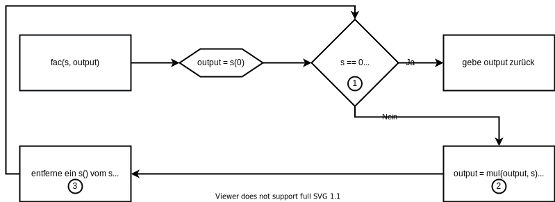

# Aufgabe 2 - Abgabe - Version 1

<div style="text-align: right">01.05.2020</div>

**Team:** 30, Hani Alshikh, Jannik Stuckstätte

**Aufgabenaufteilung:**

- Jannik Stuckstätte
  - Programabläufe des ersten Teils der Aufgabe
  - Pflege der PDF-Datei
  - Prolog Implementierung der Teilaufgaben des ersten Teil 7 & 8
  - Java Implementierung des zweiten Teil + Testfälle
  - Entwürfe entsprechend verbessern
- Hani Alshikh
  - Programabläufe des zweiten Teils der Aufgabe
  - Pflege der PDF-Datei
  - Prolog implementierung des zweiten Teils der Aufgabe
  - Prolog implementierung der Teilaufgaben des ersten Teil 1 - 6
  - Teilaufgabe 7 des zweiten Teil nachweisen
  - Entwürfe entsprechend verbessern

Jeder von uns hat zunächst alle Programabläufe/Teile der Aufgabe für sich entworfen/implementiert. Im Anschluss haben wir uns dann in Absprache für eines entschieden oder sie zu einem Ergebnis zusammengeführt.

**Quellenangaben:**

- [Rekursion in Flowcharts](https://cgi.csc.liv.ac.uk/~frans/OldLectures/COMP101/week9/recursion.html)

**Bearbeitungszeitraum:**  

- 22.04. Hani Alshikh 3 Std.  
- 23.04. Hani Alshikh 3 Std.  
- 24.04. Jannik Stuckstätte 4 Std.
- 25.04. Jannik Stuckstätte 6 Std.
- 30.04. Hani Alshikh 10 Std.
- 01.05. Jannik Stuckstätte 5 std.
- 01.05. Hani Alshikh 5 std.

**Aktueller Stand:**

- Die Entwürfe aller Aufgaben sind fertig
- Der zweite Teil ist in Prolog implementiert
- Der zweite Teil ist in Java implementiert
- Der erste Teil ist in Prolog implementiert

<div class="page"/>

**Änderungen des Entwurfs:**

- Bei del_element_all haben wir auf die diffList delegiert.
- Bei lt haben eine Prüfung, auf äquivalenz zu Beginn eingebaut und Schritt zwei und drei vertauscht, da es sonst in eine Endlosschleife kommt.

**Entwurf:**

1. Wie viele Stunden je Woche üben Sie ca. LB?  
    ~20 Std. (inklusive Bearbeitung des Praktikums)

2. Mit welchen digitalen Medien tauschen Sie sich im Team aus?  
   - Whatsapp, Discord und Gitlab

3. Welche Quellen haben Sie bisher für Aufgaben/Übungen/Erklärungen genutzt?  
   - Vorlesungsaufzeichnungen
   - [Prolog Tutorial](https://www.youtube.com/watch?v=SykxWpFwMGs&)
   - [bSimple](https://www.youtube.com/channel/UCCTii-_z90kaxio8AdGF3Bw)

4. Wie messen Sie Ihren Lernfortschritt?  
   - Anhand der Bearbeitbarkeit der Praktikumsaufgaben

5. Wie dokumentieren Sie Ihr Lernen?  
    Die Frage ist uns nicht ganz klar

## Nachweis

Für den Nachweis des Entwurfs haben wir uns für den Algorithmus von "fac" entschieden (zu finden in den Codekommentaren):

<center></center>

<div class="page"/>

## Ausgabe der Tests

```
?- test(allnat).
nat +... -..ok
nat2s...ok
s2nat...ok
add.....ok
sub....ok
mul....ok
power.......ok
fac...ok
lt +... -..ok
mods..... -ok
true.

?- test(alllist).
is_a_list +.... -...ok
diffList.... -..ok
infix +... -.....ok
suffix +... -...ok
praefix +... -...ok
eo_count....ok
del_element..ok
substitute..ok
true.
```