# Aufgabe 2 - Version 1

26.04.2020

**Team:** 30, Hani Alshikh, Jannik Stuckstätte

**Aufgabenaufteilung:**

- Jannik Stuckstätte
  - Programabläufe des ersten Teils der Aufgabe
  - Pflege der PDF-Datei
- Hani Alshikh
  - Programabläufe des zweiten Teils der Aufgabe
  - Pflege der PDF-Datei
  - Prolog implementierung des zweiten Teils der Aufgabe

Jeder von uns hat zunächst alle Programabläufe/Teile der Aufgabe für sich entworfen/implementiert. Im Anschluss haben wir uns dann in Absprache für eines entschieden oder sie zu einem Ergebnis zusammengeführt.

**Quellenangaben:**

**Bearbeitungszeitraum:**  

- 22.04. Hani Alshikh 3 Std.  
- 23.04. Hani Alshikh 3 Std.  
- 24.04. Jannik Stuckstätte 4 Std.
- 25.04. Jannik Stuckstätte 6 Std.

**Aktueller Stand:**

- Die Entwürfe aller Aufgaben sind fertig
- Der zweiter Teil ist in Prolog implementiert

**Änderungen des Entwurfs:** -

**Entwurf:**

1. Wie viele Stunden je Woche üben Sie ca. LB?  
    ~15 Std. (inklusive Bearbeitung des Praktikums)

2. Mit welchen digitalen Medien tauschen Sie sich im Team aus?  
   - Whatsapp, Discord und Gitlab

3. Welche Quellen haben Sie bisher für Aufgaben/Übungen/Erklärungen genutzt?  
   - Vorlesungsaufzeichnungen
   - [Prolog Tutorial](https://www.youtube.com/watch?v=SykxWpFwMGs&)
   - [bSimple](https://www.youtube.com/channel/UCCTii-_z90kaxio8AdGF3Bw)

4. Wie messen Sie Ihren Lernfortschritt?  
   - Anhand der Bearbeitbarkeit der Praktikumsaufgaben

5. Wie dokumentieren Sie Ihr Lernen?  
    Die Frage ist uns nicht ganz klar

## Teil 1 (Programabläufe)

### 
**1. is_a_list**

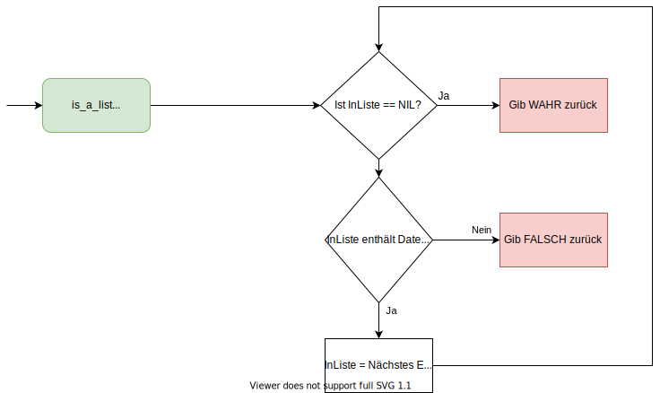

### 
**2. diffList**

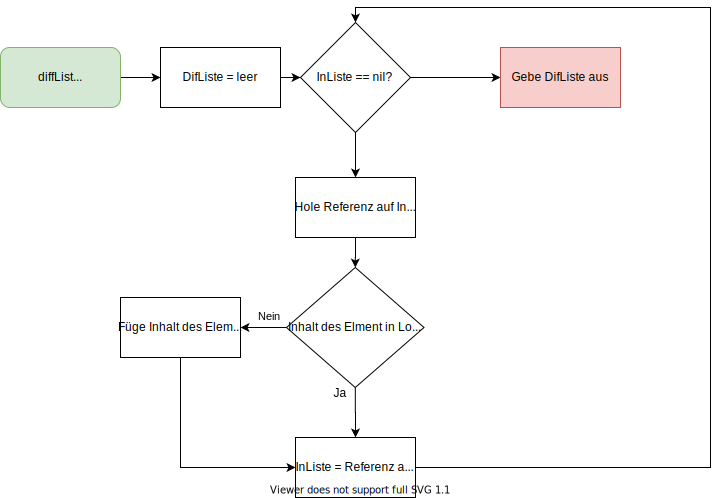

### 
**3. infix**

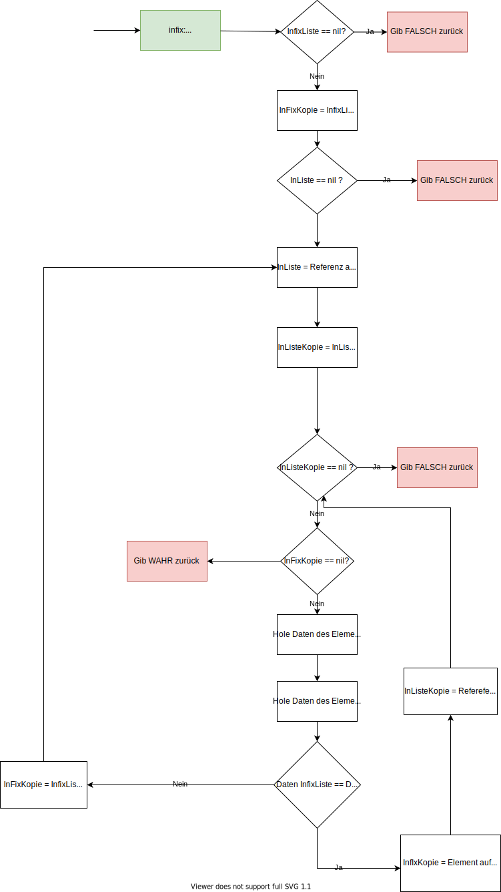

### 
**4. suffix**

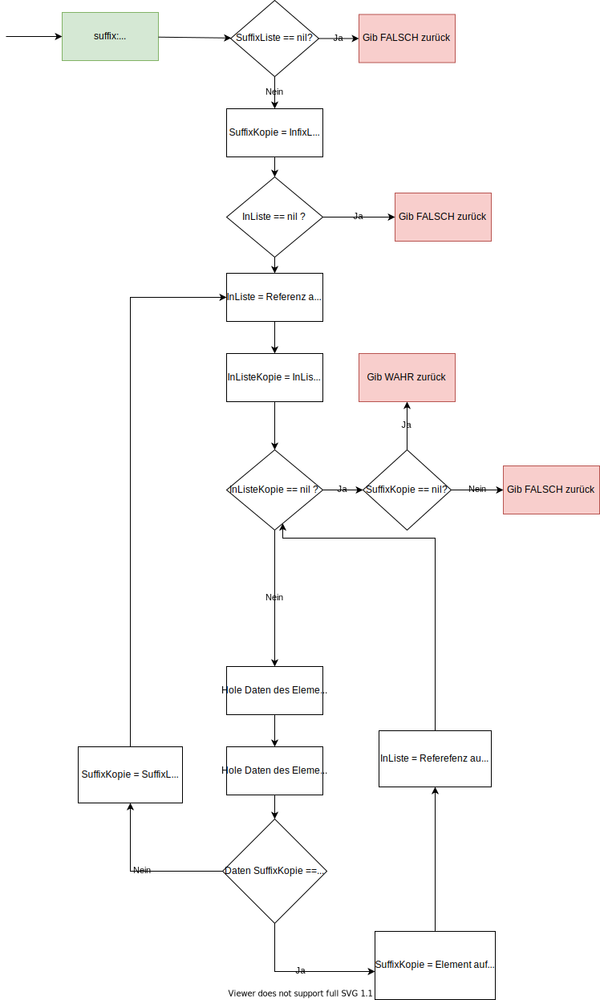

### 
**5. praefix**

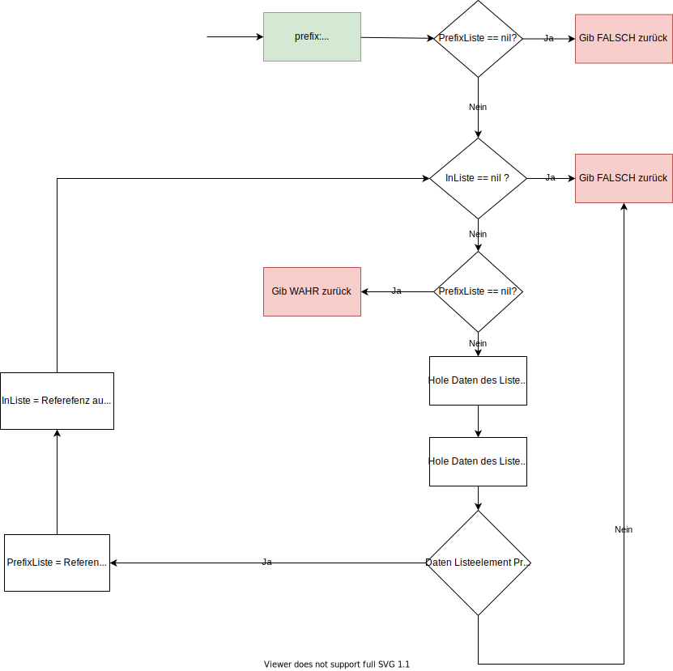

### 
**6. eo_count**

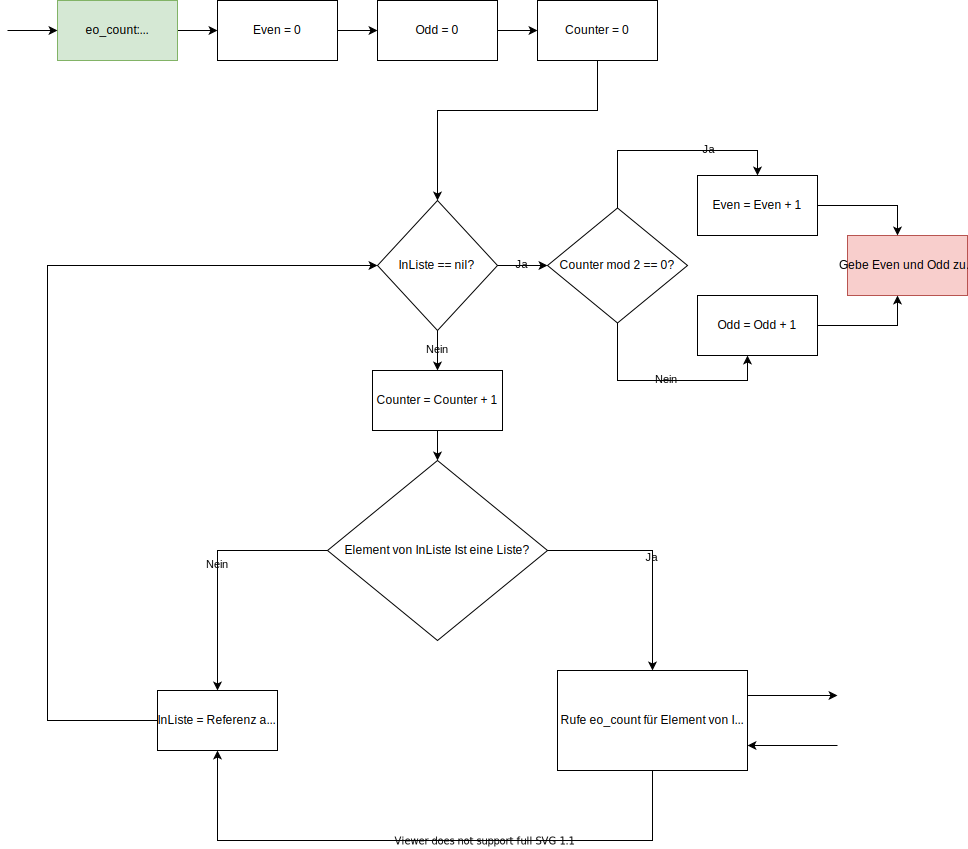

### 
**7. del_element**

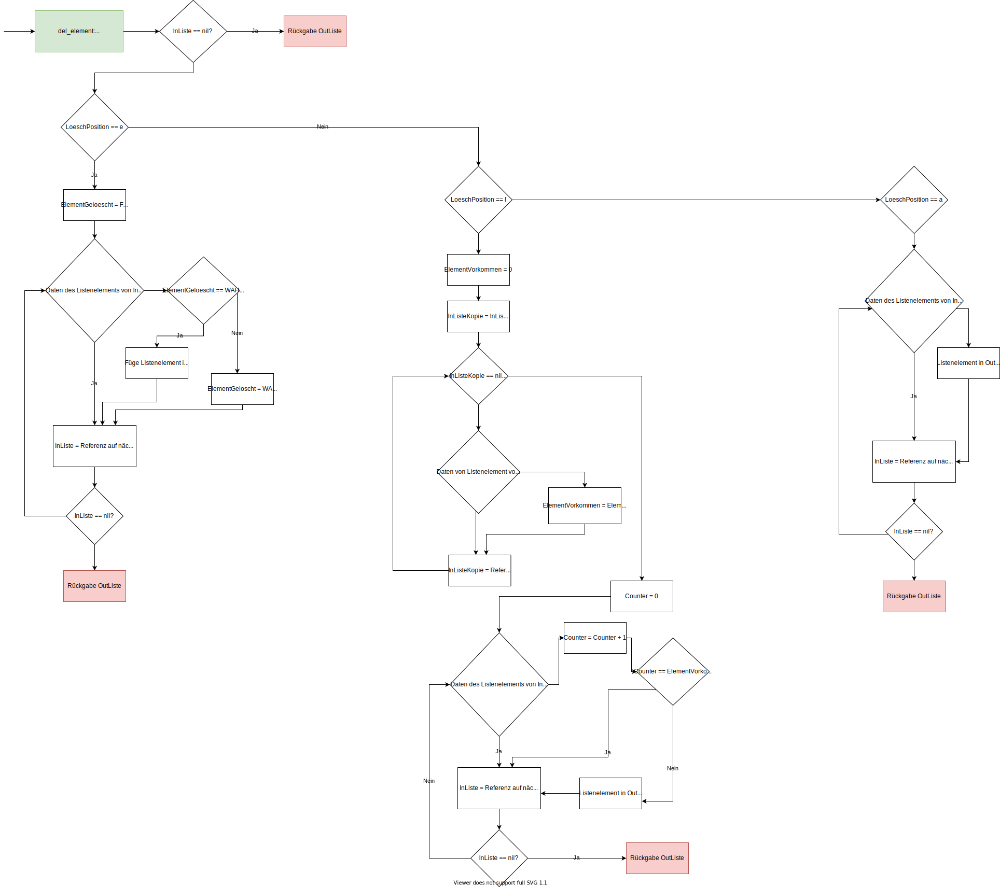

### 
**8. substitute**

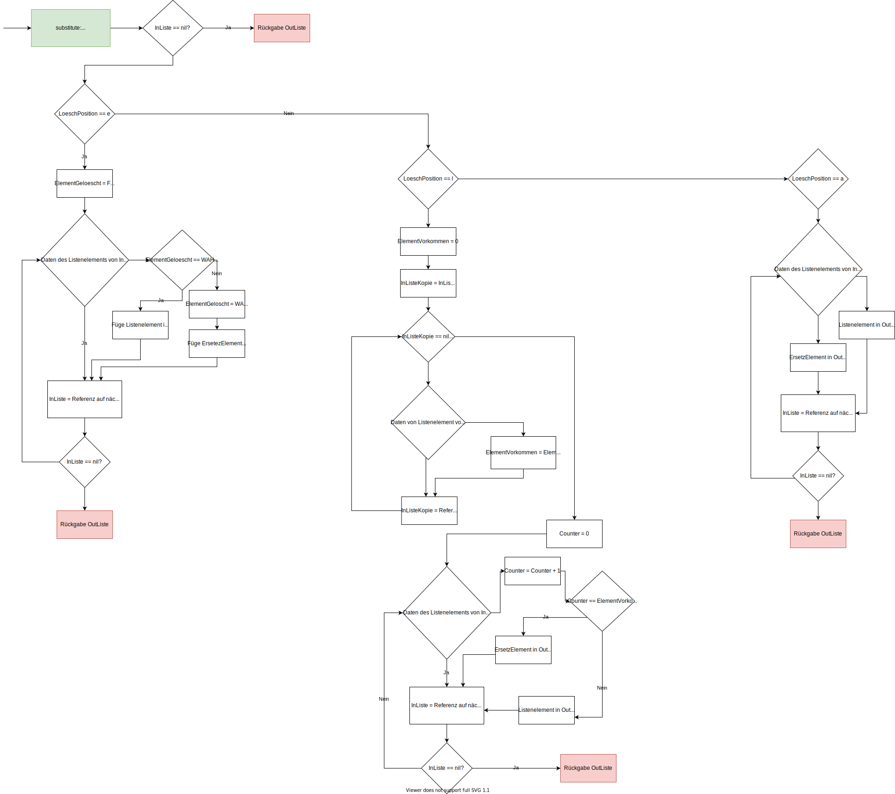

## Teil 2 (Programabläufe)

### 
**1. nat2s**

### 
**2. s2nat**

### 
**3. add**

### 
**4. sub**

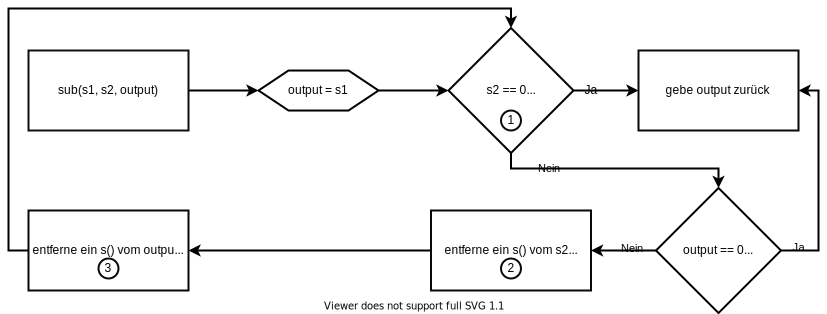

### 
**5. mul**

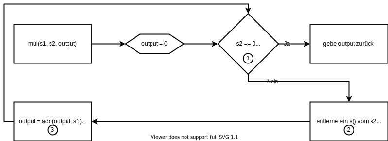

### 
**5. mul**

### 
**5. power**

### 
**5. fac**

### 
**5. lt**

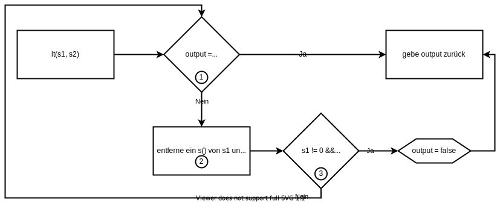

### 
**5. mods**

