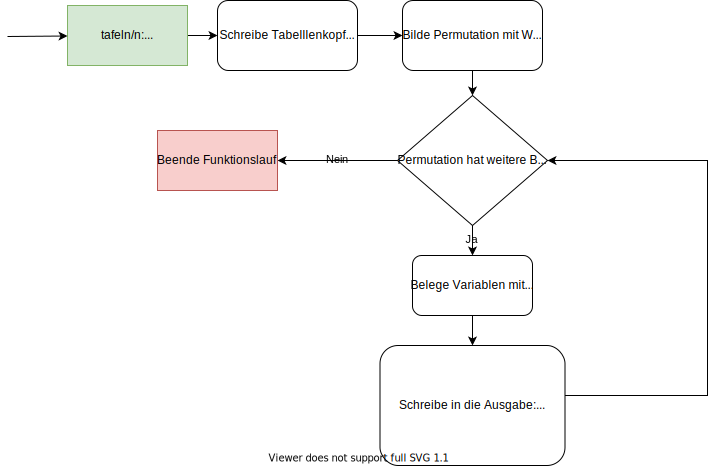
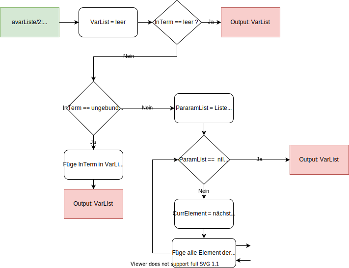
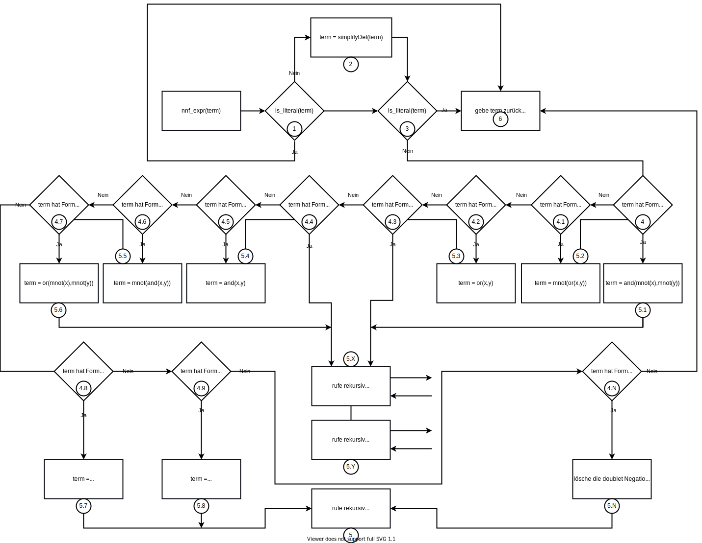
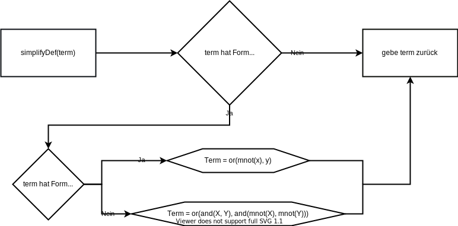
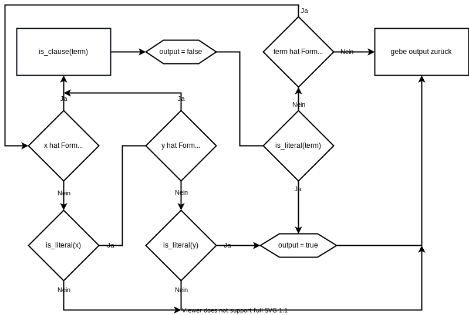

# Aufgabe 3 - Version 1

<div style="text-align: right">20.05.2020</div>

**Team:** 30, Hani Alshikh, Jannik Stuckstätte

**Aufgabenaufteilung:**

- Jannik Stuckstätte
  - Programabläufe des ersten Teils der Aufgabe
  - Pflege der PDF-Datei
  - Prolog Implementierung des zweiten Teils
  
- Hani Alshikh
  - Programabläufe des zweiten Teils der Aufgabe
  - Pflege der PDF-Datei
  - Prolog implementierung des ersten Teils der Aufgabe

Jeder von uns hat zunächst alle Programabläufe/Teile der Aufgabe für sich entworfen/implementiert. Im Anschluss haben wir uns dann in Absprache für eines entschieden oder sie zu einem Ergebnis zusammengeführt.

**Quellenangaben:**

- [Logikgatter](https://de.wikipedia.org/wiki/Logikgatter)
- [Negation](https://de.wikipedia.org/wiki/Negation#Die_Negation_in_der_zweiwertigen_Logik)
- [Konjunktion](https://de.wikipedia.org/wiki/Konjunktion_(Logik))
- [Disjunktion](https://de.wikipedia.org/wiki/Disjunktion)
- [NOR-Gatter](https://de.wikipedia.org/wiki/NOR-Gatter)
- [Implikation](https://de.wikipedia.org/wiki/Implikation#Wahrheitsfunktionale_Implikation)
- [Kontravalenz/XOR](https://de.wikipedia.org/wiki/Kontravalenz)
- [Logische Äquivalenz](https://de.wikipedia.org/wiki/Logische_%C3%84quivalenz)
- [Aussage (Logik)](https://de.wikipedia.org/wiki/Aussage_(Logik))
- [Literal](https://de.wikipedia.org/wiki/Literal)

**Bearbeitungszeitraum:**  

- 08.05 Jannik Stuckstätte 09 std.
- 15.05. Jannik Stuckstätte 06 Std.
- 08.05. Hani Alshikh 10 std.
- 15.05. Hani Alshikh 05 Std.

<div class="page"/>

**Aktueller Stand:**

- Die Entwürfe aller Aufgaben sind fertig
- Der zweite Teil ist in Prolog implementiert
- Der erste Teil ist zu 80% in Prolog implementiert

**Änderungen des Entwurfs:** -

**Entwurf:**

1. Wie viele Stunden je Woche üben Sie ca. LB?  
    ~20 Std. (inklusive Bearbeitung des Praktikums)

2. Mit welchen digitalen Medien tauschen Sie sich im Team aus?  
   - Whatsapp, Discord und Gitlab

3. Welche Quellen haben Sie bisher für Aufgaben/Übungen/Erklärungen genutzt?  
   - Vorlesungsaufzeichnungen
   - [Prolog Tutorial](https://www.youtube.com/watch?v=SykxWpFwMGs&)
   - [bSimple](https://www.youtube.com/channel/UCCTii-_z90kaxio8AdGF3Bw)

4. Wie messen Sie Ihren Lernfortschritt?  
   - Anhand der Bearbeitbarkeit der Praktikumsaufgaben

5. Wie dokumentieren Sie Ihr Lernen?  
    Die Frage ist uns nicht ganz klar

<div class="page"/>

## Zulässige Prädikate:
- [var/1](https://www.swi-prolog.org/pldoc/man?predicate=var%2f1)
- [nonvar/1](https://www.swi-prolog.org/pldoc/doc_for?object=nonvar/1)
- [fail/0](https://www.swi-prolog.org/pldoc/doc_for?object=fail/0)
- [nl/0](https://www.swi-prolog.org/pldoc/doc_for?object=nl/0)
- [write/1](https://www.swi-prolog.org/pldoc/doc_for?object=write/1)
- [writeln/1](https://www.swi-prolog.org/pldoc/doc_for?object=writeln/1)
- [list_to_set/2](https://www.swi-prolog.org/pldoc/doc_for?object=list_to_set/2)
- [=../2](https://www.swi-prolog.org/pldoc/doc_for?object=(%3D..)/2)
- [append/3](https://www.swi-prolog.org/pldoc/doc_for?object=append/3)

## Teil 1 (Programabläufe)

### <center>**1.1 mnot/1**</center>

##### Bedeutung
>_In der klassischen Logik, in der genau zwei Wahrheitswerte wahr und falsch – betrachtet werden, ist die Negation unmittelbar als Umkehrung des Wahrheitswertes in sein Gegenteil fassbar: Wenn man eine wahre Aussage verneint, dann entsteht eine falsche Aussage; verneint man hingegen eine falsche Aussage, so entsteht eine wahre Aussage._

#### Formale Formulierung

```Y = ¬A```

#### Warheheitstabelle

| A |  | Y |
|---|--|---|
| 0 |  | 1 |
| 1 |  | 0 |

<div class="page"/>

### <center>**1.2 and/2**</center>

#### Bedeutung

>_In der klassischen Logik ist die Konjunktion zweier Aussagen A und B genau dann wahr, wenn sowohl A als auch B wahr sind, und genau dann falsch, wenn mindestens eine der beiden Aussagen A, B  falsch ist._

#### Formale Formulierung

```Y = A ∧ B```

#### Warheheitstabelle

| A | B |  | Y |
|---|---|--|---|
| 0 | 0 |  | 0 |
| 0 | 1 |  | 0 |
| 1 | 0 |  | 0 |
| 1 | 1 |  | 1 |

### <center>**1.3 or/2**</center>

#### Bedeutung

>_Die nicht-ausschließende Disjunktion (Alternative, Adjunktion) ist eine zusammengesetzte Aussage vom Typ „A oder B (oder beides)“; sie sagt aus, dass mindestens eine der beiden beteiligten Aussagen wahr ist._

#### Formale Formulierung

```Y = A ∨ B```

#### Warheheitstabelle

| A | B |  | Y |
|---|---|--|---|
| 0 | 0 |  | 0 |
| 0 | 1 |  | 1 |
| 1 | 0 |  | 1 |
| 1 | 1 |  | 1 |

<div class="page"/>

### <center>**1.4 nor/2**</center>

#### Bedeutung

>_Ein NOR-Gatter (von englisch: not or – nicht oder, oder von englisch nor – noch; auch Peirce-Funktion nach Charles S. Peirce genannt) ist ein Logikgatter mit zwei oder mehr Eingängen A, B, … und einem Ausgang Y, zwischen denen die logische Verknüpfung NICHT ODER besteht. Ein NOR-Gatter gibt am Ausgang 1 (w) aus, wenn alle Eingänge 0 (f) sind. In allen anderen Fällen, d. h. wenn mindestens ein Eingang 1 ist, wird eine 0 ausgegeben._

#### Formale Formulierung

```Y = ¬(A ∨ B)```

#### Warheheitstabelle

| A | B |  | Y |
|---|---|--|---|
| 0 | 0 |  | 1 |
| 0 | 1 |  | 0 |
| 1 | 0 |  | 0 |
| 1 | 1 |  | 0 |

### <center>**1.5 impl/2**</center>

#### Bedeutung

>_Die Subjunktion ist nur dann falsch, wenn A wahr und B falsch ist._

#### Formale Formulierung

```Y = A → B``` oder auch ```Y = ¬A ∨ B```

#### Warheheitstabelle

| a | b |  | Y |
|---|---|--|---|
| f | f |  | w |
| f | w |  | w |
| w | f |  | f |
| w | w |  | w |

<div class="page"/>

### <center>**1.6 xor/2**</center>

#### Bedeutung

>_Synonym mit Kontravalenz werden auch die Bezeichnungen ausschließende Disjunktion (auch vollständige oder antivalente Disjunktion), Bisubtraktion, ausschließendes Oder, Antivalenz, kontradiktorischer Gegensatz, Kontrajunktion oder Alternation verwendet. In der Schaltalgebra spricht man von dem Exklusiv-Oder-Gatter (XOR-Gatter), in der Aussagenlogik nennt man sie XOR-Verknüpfung. [...] Definiert wird die Kontravalenz durch die Wahrheitswertefunktion ihres Junktors: **Eine Kontravalenz ist genau dann wahr, wenn beide durch sie verbundenen Aussagen unterschiedliche Wahrheitswerte haben, das heißt, wenn entweder die eine oder die andere wahr ist, wenn aber nicht beide gleichzeitig wahr oder beide gleichzeitig falsch sind.**_

#### Formale Formulierung

```Y = A ⊕ B``` oder auch ```(A V B) ∧ (¬A V ¬B)```

#### Warheheitstabelle

| A | B |  | Y |
|---|---|--|---|
| w | w |  | f |
| w | f |  | w |
| f | w |  | w |
| f | f |  | f |

### <center>**1.7 aequiv/2**</center>

#### Bedeutung

>_Eine logische Äquivalenz liegt vor, wenn zwei logische Ausdrücke den gleichen Wahrheitswert besitzen._

#### Formale Formulierung

```A ↔ B``` oder auch ```(A → B) ∧ (B → A)``` oder auch ```(¬A ∨ B) ∧ (¬B V A)```

#### Warheheitstabelle

| A | B |  | Y |
|---|---|--|---|
| w | w |  | w |
| w | f |  | f |
| f | w |  | f |
| f | f |  | w |

<div class="page"/>

### <center>**3. tafel2/3**</center>

Für **tafel2/3** wird an [tafeln/2](##-<center>**5.-tafeln/2**</center>) deligiert.

### <center>**4. tafel3/4**</center>

Für **tafel3/4** wird an [tafeln/2](##-<center>**5.-tafeln/2**</center>) deligiert.

### <center>**5. tafeln/2**</center>

<center></center>

<div class="page"/>

### <center>**6. avarListe/2**</center>

<center></center>

<div class="page"/>

### **Spezifikation für die Umsetzung in Java**

```java
public abstract class Term {
    public Term TermLinks;
    public Term TermRechts;

    public Term(Term TermLinks, Term TermRechts){
        this.TermLinks = TermLinks;
        this.TermRechts = TermRechts;
    }

    public Term(Term TermLinks){
        this.TermLinks = TermLinks;
        this.TermRechts = null;
    }

    public Term(){
        this.TermLinks = null;
        this.TermRechts = null;
    }

    public abstract boolean auswerten();
   
    ...}
```

## Teil 2 (Programabläufe)

### <center>**1. is_atomic_expr**</center>

##### Bedeutung

> _Als atomare Aussagen werden in der mathematischen oder formalen Logik Aussagen bezeichnet, die nicht aus anderen Aussagen zusammengesetzt sind. Sie enthalten daher keine aussagenverknüpfenden logischen Operatoren (Junktoren) wie ∧ (und), ∨ (oder) und ¬ (nicht). Der Gegenbegriff ist die zusammengesetzte Aussage oder Aussagenverknüpfung._

### <center>**2. is_literal**</center>

##### Bedeutung

> _In der mathematischen Logik ist ein Literal eine atomare Aussage (Atom) oder die Negation einer atomaren Aussage. Man hat daher positive Literale und negative Literale._

<div class="page"/>

### <center>**3. nnf_expr**</center>

<center></center>

##### SimplifyDef

<center></center>

<div class="page"/>

### <center>**4. is_clause**</center>

<center></center>

<div class="page"/>

### <center>**5. is_horn_clause**</center>

<center></center>

<div class="page"/>

### **Spezifikation für die Umsetzung in Java**

```java
public abstract class Term {
    public Term TermLinks;
    public Term TermRechts;

    public Term(Term TermLinks, Term TermRechts){
        this.TermLinks = TermLinks;
        this.TermRechts = TermRechts;
    }

    public Term(Term TermLinks){
        this.TermLinks = TermLinks;
        this.TermRechts = null;
    }

    public Term(){
        this.TermLinks = null;
        this.TermRechts = null;
    }

    public abstract boolean auswerten();
   
    ...}
```