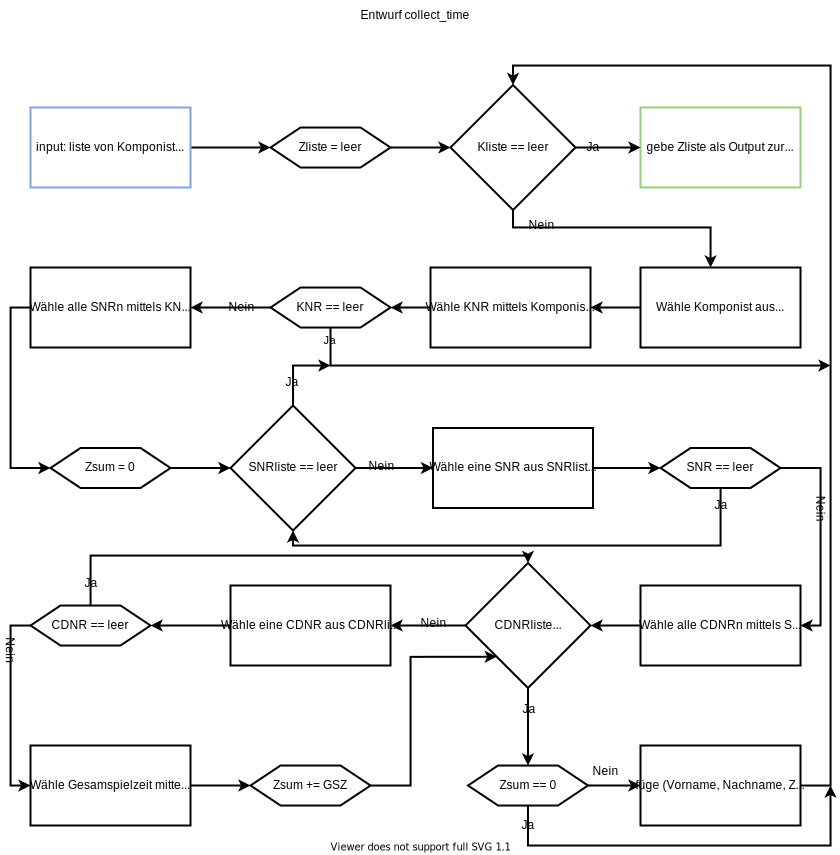

Team: 30, Hani Alshikh, Jannik Stuckstätte
Aufgabenaufteilung: 
1.	<Aufgaben, für die Teammitglied 1 verantwortlich ist>, 
<Dateien, die komplett/zum Teil von Teammitglied 1 implementiert/bearbeitet wurden>
2.	<Aufgaben, für die Teammitglied 2 verantwortlich ist>, 
<Dateien, die komplett/zum Teil von Teammitglied 2 implementiert/bearbeitet wurden>
Quellenangaben: <Angabe aller genutzten Quellen, z.B. auch Code, Ideen etc. von Dritten>
Bearbeitungszeitraum: 
02.04. Jannik Stuckstätte 4 Std.
04.04. Hani Alshikh 6 Std.

Aktueller Stand: <Der Entwurf ist ausführlich und fertig. Falls mit der Implementierung schon angefangen wurde: welche Teile der Software sind fertig inklusive Tests, welche sind fertig, aber noch nicht getestet, welche müssen noch implementiert werden>
Änderungen des Entwurfs: <Vor dem Praktikum auszufüllen: Welche Änderungen sind bzgl. des Entwurfs während der Implementierung vorgenommen worden.>
Entwurf: <Entwurf nach den bekannten SE-Richtlinien und den Vorgaben gemäß Aufgabenstellung.>
1.	Wie viele Stunden je Woche üben Sie ca. LB?
~10 Std. (inklusive Bearbeitung des Praktikums)
2.	Mit welchen digitalen Medien tauschen Sie sich im Team aus?
Whatsapp und Discord
3.	Welche Quellen haben Sie bisher für Aufgaben/Übungen/Erklärungen genutzt?
Vorlesungsaufzeichnungen
4.	Wie messen Sie Ihren Lernfortschritt?
Anhand der Bearbeitbarkeit der Praktikumsaufgaben
5.	Wie dokumentieren Sie Ihr Lernen?
Die Frage ist uns nicht ganz klar

### Entwurf vorfahre, nachkomme, nachkommen

laut Wikipedia:

- **Vorfahr:** bezeichnet einen biologischen Eltern- oder Vorelternteil eines Lebewesens, von dem es in direkter Linie abstammt und dessen blutsverwandter Nachfahre es ist. Zweigeschlechtliche Lebewesen haben mutter- und vaterseitige Vorfahren.

- **Nachkomme:** bezeichnet in der Biologie ein Individuum, das bei der Fortpflanzung von Lebewesen entsteht – bei Menschen ein Kind oder dessen Kind(eskind).

- **Kind:** Die Kinder sind die unmittelbaren Nachkommen einer Person, die biologisch von ihr in gerader Linie abstammen, oder die rechtlich als ihre Kinder festgestellt oder von ihr „an Kindes statt“ adoptiert wurden:

Vorhandene Datenbankeinträge:

- elternteil(<Elternteil>,<Kind>), abgekürzt mit et - weiblich(<Person>), abgekürzt mit w
- männlich(<Person>), abgekürzt mit m

Definition der Begriffe mittels Datenbakeinträgen:

- **Vorfahr:** vorfahr(Vorfahr, Person): et(Vorfahr, Person) und vorfahr(Vorvorfahr, Vorfahr)  

    mit et(Vorfahr, Person) werden die Vorfahre der Person gesucht.  

    mit vorfahr(Vorvorfahr, Vorfahr) werden die Vorvorfahre vom Vorfahr gesucht.  

    die Rekursion kümmert sich um alle Vorfahre und endet, wenn keine Vorfahre mehr gibt.

- **Nachkomme:** nachkomme(Nachkomme, Person): et(Person, Nachkomme) und nachkomme(Nachkomme, Nachnachkomme)  

    mit et(Person, Nachkomme) werden die Nachkommen der Person gesucht.  

    mit nachkomme(Nachkomme, Nachnachkomme) werden die Nachnachkommen vom Nachkomme gesucht.  

    die Rekursion kümmert sich um alle Nachkommen und endet, wenn keine Nachkommen mehr gibt.