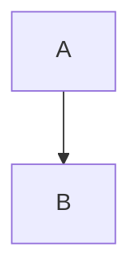

Professor:: Dr. Bernd Kahlbrandt  
Author:: Nick Marvin Rattay  
Author:: Hani Alshikh  

19.10.2019

# Einheiten umrechnen

input uml diagram

##### Quellen
- [Potrzebie unit system (Names)](https://tex.stackexchange.com/questions/369070/can-one-use-the-potrzebie-unit-system-in-latex)
- [Stdin trick for ruby testing](https://stackoverflow.com/questions/16948645/how-do-i-test-a-function-with-gets-chomp-in-it)